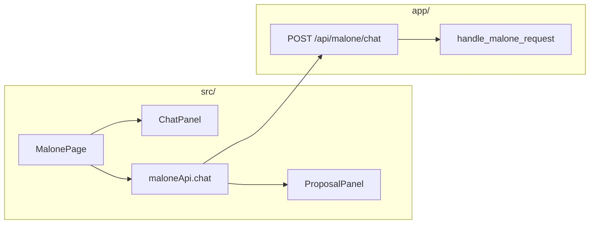
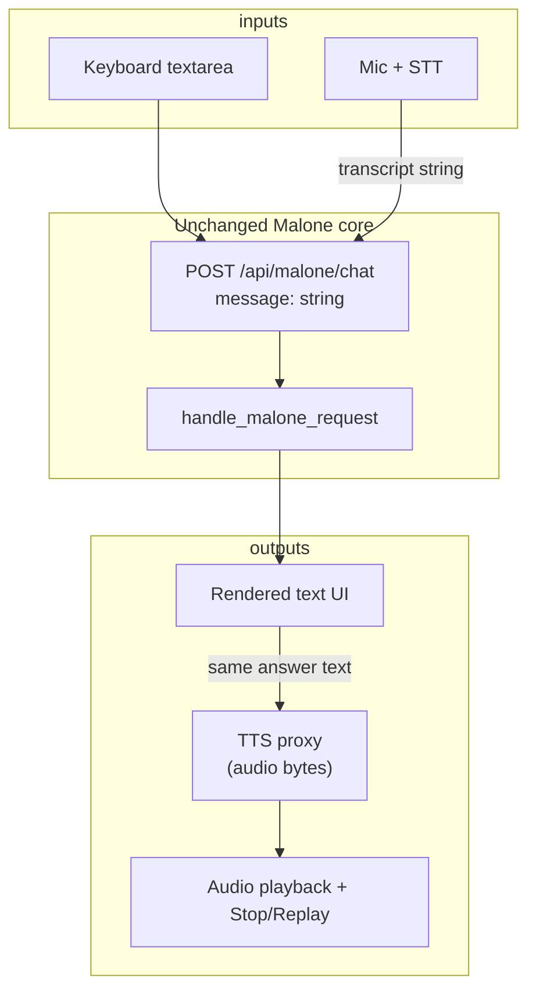

# Malone Voice — Architecture Plan

**Date:** 2026-04-16  
**Principle:** Voice is a **transport and playback layer** around the existing Malone text pipeline. Do not fork intent, truth packets, or proposal persistence.

---

## Current architecture (grounded)

- Chat is **request/response JSON**; no WebSocket in `maloneApi.js`.
- Delivered user text is `delivery.answer` in the JSON consumed by `ProposalPanel`.

---

## Target architecture (incremental)

### Boundaries

| Layer | Owns |
|--------|------|
| **STT adapter** | Mic permissions, streaming or final transcript, errors → user message. |
| **Malone** | Intent, workflows, truth packet, verification, `delivery` — unchanged. |
| **TTS adapter** | Text normalization (strip excessive markdown if needed), voice id, ElevenLabs HTTP, audio bytes. |
| **Playback UI** | `Audio` element, stop, replay, optional volume; optional “auto-read” toggle. |

### What not to add (for V1)

- Parallel “voice agent” or duplicate chat route.
- WebSocket streaming for Malone text unless product requires it later.
- Persisting raw audio blobs in SQLite without a retention policy.

---

## File map (suggested homes, active lane only)

| Concern | Likely location |
|---------|------------------|
| TTS proxy route | `app/api/malone_routes.py` (new paths) or `app/api/voice_routes.py` + include in `app/main.py` |
| ElevenLabs client | `app/services/elevenlabs_service.py` (new, small) |
| STT (server path, if any) | `app/services/stt_service.py` (future) |
| Client TTS + playback | `src/components/malone/` (e.g. `MaloneVoicePlayback.jsx`) or state in `MalonePage.jsx` |
| API helpers | `src/lib/maloneApi.js` extensions |

---

## Config surface (server)

- `ELEVENLABS_API_KEY` (required for TTS proxy).
- Optional: `ELEVENLABS_VOICE_ID`, `ELEVENLABS_MODEL_ID`, timeouts.
- Existing: `OPENAI_*` for render path — independent from TTS.

---

## Deterministic inventory reference

See `tracking/reports/malone_voice_inventory.json` for term hits across `app/`, `src/`, `tracking/`, `tests/`.
